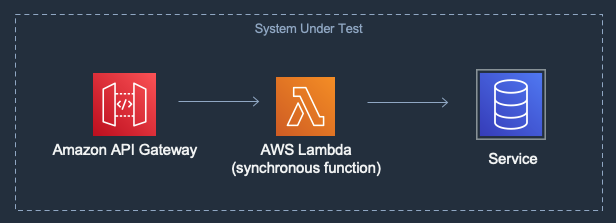
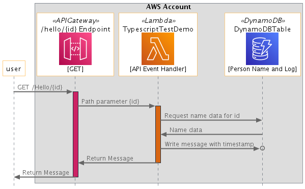

[](https://badgen.net/badge/Built%20With/TypeScript/blue9)
[](https://img.shields.io/badge/AWS-DynamoDB-blueviolet)
[](https://img.shields.io/badge/Test-Unit-blue)
[](https://img.shields.io/badge/Test-Integration-yellow)

# Typescript: Amazon Api Gateway, AWS Lambda, Amazon DynamoDB Example

## Introduction

This project contains introductory examples of TypeScript tests written for AWS Lambda. This is a great place to start!

The project uses the [AWS Serverless Application Model](https://docs.aws.amazon.com/serverless-application-model/latest/developerguide/what-is-sam.html) (SAM) CLI for configuration, testing and deployment. 

---

## Contents

- [Introduction](#introduction)
- [Contents](#contents)
- [About this Pattern](#about-this-pattern)
- [About this Example](#about-this-example)
  - [Key Files in the Project](#key-files-in-the-project)
- [Sample project description](#sample-project-description)
- [Run the Unit Test](#run-the-unit-test)
- [Run the Integration Test](#run-the-integration-test)

---

## About this Pattern

### System Under Test (SUT)

The SUT in this pattern is a synchronous API composed of Amazon API Gateway, AWS Lambda and a persistence layer in Amazon DynamoDB. Amazon API Gateway may contain an authorization feature like Cognito or a Lambda custom authorizer.



### Goal

The goal of this pattern is to test the SUT in environment as similar to production as possible by running tests against resources deployed to the cloud.

### Description

The SUT will be deployed to the AWS cloud. The test code will create an HTTP client that will send requests to the deployed API Gateway endpoint. The endpoint will invoke the backing services, test resource configuration, IAM permissions, authorizers, and internal business logic of the SUT.


[Top](#contents)
---

## About this Example

This specific sample project allows a user to call an API endpoint generate a custom "hello" message, and also tracks the messages it generates.  A user provides an "id", which the endpoint uses to look up the person's name associated with that id, and generates a message.  The message is recorded in DynamoDB and also returned to the caller:



This project consists of an [API Gateway](https://aws.amazon.com/api-gateway/), a single [AWS Lambda](https://aws.amazon.com/lambda) function, and a [Amazon DynamoDB](https://aws.amazon.com/dynamodb) table.

The DynamoDB Table uses a [single-table design](https://aws.amazon.com/blogs/compute/creating-a-single-table-design-with-amazon-dynamodb/), as both the name lookup and the message tracking use the same table. The table schema is defined as follows:

* For all records, the "Partition Key" is the id.
* For name records, the "Sort Key" is set to a constant = "NAME#"
* For message history records, the "Sort Key" is set to "TS#" appended with the current date-time stamp.
* The payloads are in a field named "data".

### Key Files in the Project

  - [app.ts](src/app.ts) - Lambda handler code to test
  - [template.yaml](template.yaml) - SAM script for deployment
  - [test-handler.test.ts](src/tests/unit/test-handler.test.ts) - Unit test using mocks
  - [integ-handler.test.ts](src/tests/integration/integ-handler.test.ts) - Integration tests on a live stack

[Top](#contents)
---

## Run the Unit Tests
[test-handler.test.ts](src/tests/unit/test-handler.test.ts) 

In the [unit test](src/tests/unit/test-handler.test.ts#L44), all references and calls to the DynamoDB service are mocked using aws-sdk-client-mock client.
To run the unit tests
``` shell
apigw-lambda-dynamodb$ cd src
src $ npm install
src $ npm run test:unit
```

[Top](#contents)

---

## Run the Integration Tests
[integ-handler.test.ts](src/tests/integration/integ-handler.test.ts) 

For integration tests, deploy the full stack before testing:
```shell
apigw-lambda-dynamodb$ sam build
apigw-lambda-dynamodb$ sam deploy --guided
```
 
The [integration tests](src/tests/integration/integ-handler.test.ts) need to be provided 2 environment variables. 

1. The `DYNAMODB_TABLE_NAME` is the name of the DynamoDB table providing persistence. 
    * The integration tests [seed data into the DynamoDB table](src/tests/integration/integ-handler.test.ts#L24-28).
    * The [integration test tear-down](src/tests/integration/integ-handler.test.ts#L30-49) removes the seed data, as well as data generated during the test.
2. The `API_URL` is the base URL of the API Gateway deployment stage, which should end with `/Prod/` in this case.

Set up the environment variables, replacing the `<PLACEHOLDERS>` with your values:
```shell
src $ export DYNAMODB_TABLE_NAME=<YOUR_DYNAMODB_TABLE_NAME>
src $ export API_URL=<YOUR_APIGATEWAY_BASE_URL>
```

Then run the test suite.
```shell
apigw-lambda-dynamodb$ cd src
src $ npm install
src $ npm run test:integration
```

Alternatively, you can set the environment variables and run the test suite all in one command:
```shell
apigw-lambda-dynamodb$ cd src
src $ npm install
src $ DYNAMODB_TABLE_NAME=<YOUR_DYNAMODB_TABLE_NAME> API_URL=<YOUR_APIGATEWAY_BASE_URL> npm run test:integration
```

[Top](#contents)